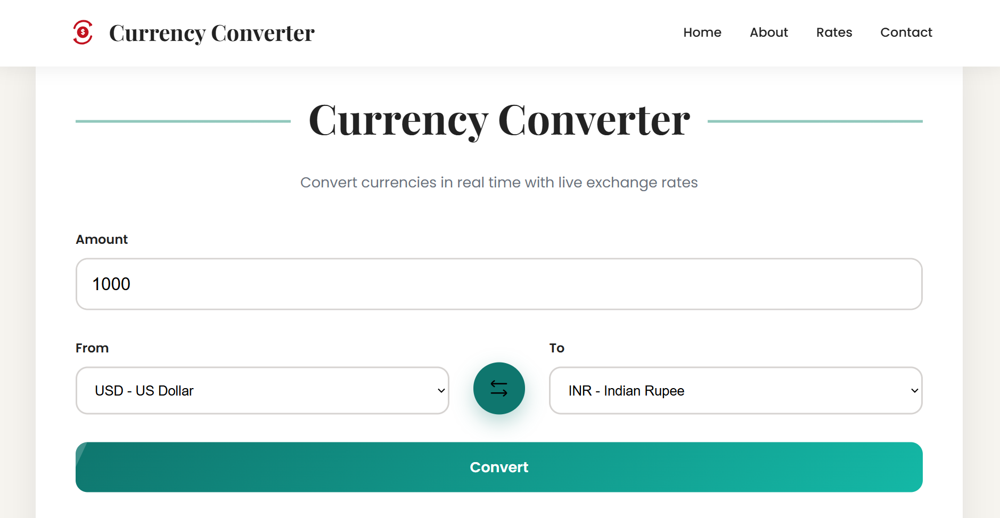
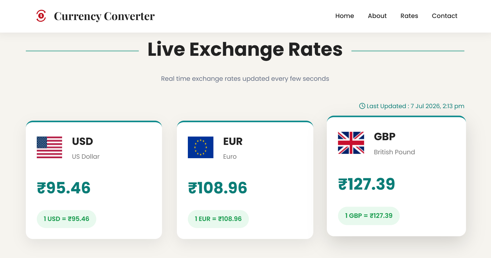
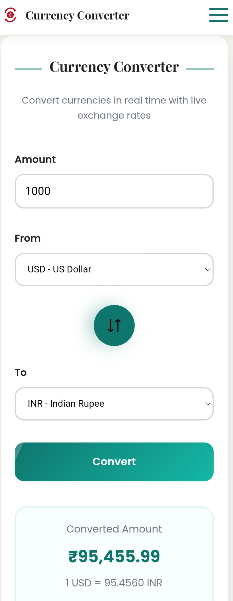

# 💱 Currency Converter

A modern and responsive **Currency Converter** built using **HTML, CSS, and JavaScript**. It provides real-time exchange rates, live currency conversion, interactive animations, and a clean user experience across all devices.

---

### Live Demo

[](https://currency-converter-green-seven.vercel.app/)

---

## 📸 Screenshots

### 🖥️ Desktop - Currency Converter



---

### 📊 Live Exchange Rates



---

### 📱 Mobile View

<p align="center">
  
</p>

---

## ✨ Features

- 🌍 Real-time currency conversion using Exchange Rate API
- 💹 Live exchange rate cards
- 🔄 Currency swap functionality
- 📱 Fully responsive design
- ⚡ Loading spinner while fetching data
- 🔔 Animated toast notifications
- 🎯 Smooth scroll animations
- 🕒 Last updated timestamp
- 🎨 Clean and modern UI

---

## 🛠️ Tech Stack


---


## 📂 Project Structure

```text
Currency-Converter/
│── images/
│── ABOUT_PAGE/
│── screenshots/
│── index.html
│── style.css
│── script.js
└── README.md
```

---

## ⚙️ Installation

Clone the repository

```bash
git clone https://github.com/kaish10-hub/currency-converter.git
```

Open the project

```bash
cd currency-converter
```

Run the project

```text
Open index.html in your browser
```

---

## 📌 Future Improvements

- 🌙 Dark Mode
- 📈 Historical exchange rate charts
- ⭐ Favorite currencies
- 🌐 Multi-language support

---

## 👥 Authors

### Mohd Kaish
- 🌐 GitHub: [@kaish10-hub](https://github.com/kaish10-hub)
- 💼 LinkedIn: [Mohd Kaish](https://www.linkedin.com/in/mohd-kaish10)

### Radhika Singh
- 🌐 GitHub: [@Radhikasingh28](https://github.com/Radhikasingh28)
- 💼 LinkedIn: [Radhika Singh](https://www.linkedin.com/in/radhika-singh-31b27a345/)
  
---

## ⭐ Show your support

If you like this project, consider giving it a **⭐ Star** on GitHub.

It motivates me to build more awesome projects!
